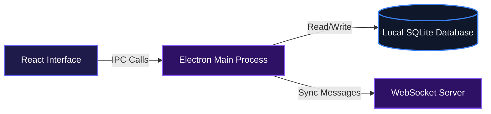
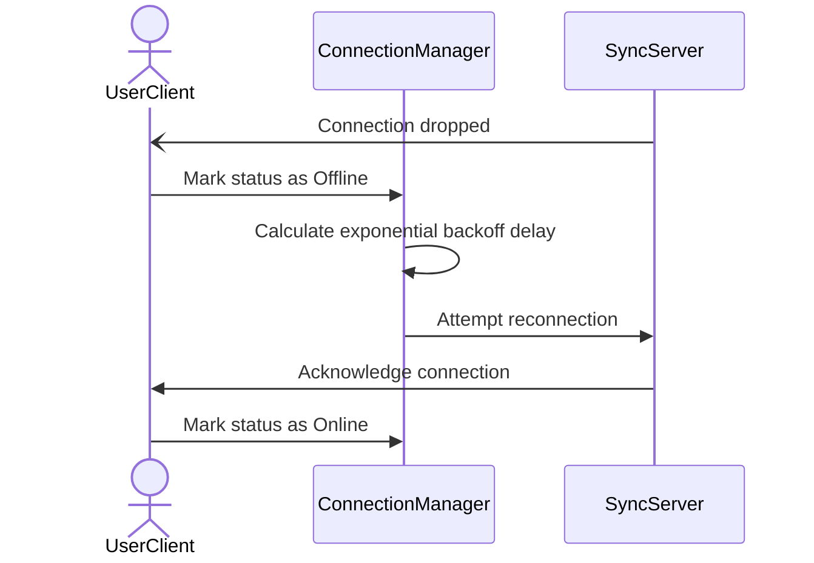
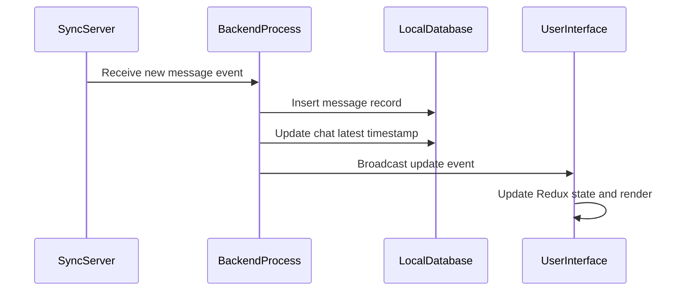

# Secure Messenger Desktop

Secure Messenger Desktop provides users with a fast and reliable desktop chat experience that works seamlessly whether online or offline. It gives individuals and teams a localized communication interface that automatically syncs messages when connected and safely stores them locally when the internet drops. There is no complicated setup, just a straightforward messaging platform that prioritizes reliability and speed.

## System Architecture



## Installation

Clone the repository and install the dependencies to run the app locally.

```bash
git clone https://github.com/samueltuoyo15/messaging-desktop-app.git
cd messaging-desktop-app
npm install
```

Start the application in development mode:

```bash
npm run dev
```

Build the application for production:

```bash
npm run build
```

## Usage

Once the application launches, the main window will display a sidebar with your chat history and a main viewing area for active conversations. The database seeds itself with initial test data automatically, allowing you to click through chats and view messages instantly. 

You can interact with the connection simulation tools built right into the interface. Clicking the "Simulate Disconnect" button in the header will force the application offline, letting you test the local data persistence and the automatic reconnection backoff logic.

## Features

* **Real-Time Communication**: Instantly send and receive messages using a persistent WebSocket connection.
* **Offline First Architecture**: All chats and messages are stored locally. Users can browse their entire history without an active internet connection.
* **Smart Connection Resilience**: Automatically detects network drops and attempts to reconnect using an intelligent exponential backoff strategy.



* **Virtual Scrolling Integration**: Easily renders thousands of chats and messages without degrading UI performance or freezing the desktop window.
* **Data Persistence**: Captures incoming socket events and safely commits them to a local SQLite database before broadcasting to the frontend view.



## Technologies Used

* Electron
* React
* TypeScript
* Material-UI
* Redux Toolkit
* Better SQLite3
* WebSockets

## Contributing

Contributions are welcome. Feel free to open an issue if you find a bug or want to suggest a new feature. To contribute code, please fork the repository, create a new branch for your feature or bug fix, and submit a pull request with a detailed description of your changes.

## Author

Samuel Tuoyo

* LinkedIn: https://linkedin.com/in/samueltuoyo
* X (Twitter): https://x.com/TuoyoS26091

***

[](https://www.typescriptlang.org/)
[](https://reactjs.org/)
[](https://www.electronjs.org/)
[](https://mui.com/)
[](https://www.sqlite.org/)
[](https://redux.js.org/)

[](https://dokugen.samueltuoyo.com)